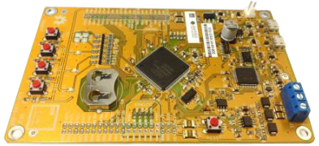
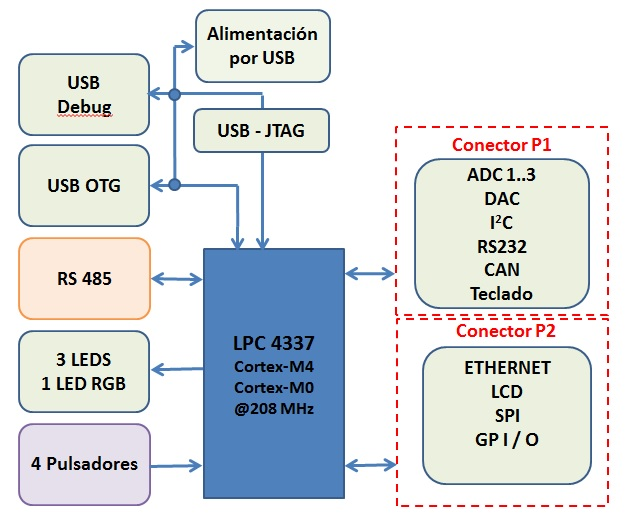

# MicroPython y la EDU-CIAA-NXP

Desarrollos en MicroPython con la placa EDU-CIAA-NXP, basada en el LPC4337 (dual core ARM Cortex-M4F y Cortex-M0).

El repositorio es una colección de recursos extraídos del sitio oficial del [Proyecto CIAA](https://www.proyecto-ciaa.com.ar/index.html), excepto el directorio `/scripts/ejemplos` que contiene diversos scripts de ejemplo.

---

## EDU-CIAA-NXP

La [EDU-CIAA-NXP](https://www.proyecto-ciaa.com.ar/devwiki/doku.php%3Fid=desarrollo:edu-ciaa:edu-ciaa-nxp.html) es una **versión de bajo costo de la CIAA-NXP pensada para la enseñanza universitaria, terciaria y secundaria**.

### Bloques funcionales

La EDU-CIAA está basada en la CIAA-NXP, por ser la primera versión de la CIAA que se encuentra disponible. Por lo tanto su microcontrolador es también el LPC4337 (dual core ARM Cortex-M4F y Cortex-M0).

Sin embargo, con el objetivo de abaratar costos y reducir su complejidad la EDU-CIAA incorpora sólo algunas de las funcionalidades de la CIAA. A su vez, con el fin de permitir el desarrollo de algunas prácticas sencillas sin que sea necesario recurrir a hardware adicional, incluye además algunos recursos que no están presentes en la CIAA.

### Diagrama en bloques de la plataforma

En la siguiente figura se observa un diagrama en bloques de la EDU-CIAA basada en LPC4337:

La EDU-CIAA cuenta con los siguientes módulos:

* 2 puertos micro-USB (uno para aplicaciones y debugging, otro para alimentación).
* 4 salidas digitales implementadas con leds RGB.
* 4 entradas digitales con pulsadores.
* 1 puerto de comunicaciones RS 485 con bornera.
* 2 conectores de expansión:
    * P1:
        * 3 entradas analógicas (ADC0_1,2y3),
        * 1 salida analógica (DAC0),
        * 1 puerto I2C,
        * 1 puerto asincrónico full duplex (para RS-232).
        * 1 puerto CAN,
        * 1 conexión para un teclado de 3x4,

    * P2:
        * 1 puerto Ethernet,
        * 1 puerto SPI,
        * 1 puerto para Display LCD con 4 bits de datos, Enable y RS.
        * 9 pines genéricos de I/O.

Consultar la asignación de pines de la EDU-CIAA-NXP en PDF, con información del uso de los mismos en el microcontrolador: [Asignación de pines](./Pinout.pdf).

## Propósito, alcance, objetivos y requerimientos de la EDU-CIAA-NXP

### Propósito

Los propósitos de la EDU-CIAA son:

* Proveer una plataforma de desarrollo moderna y económica basada en la CIAA que sirva a docentes y a estudiantes en los cursos de sistemas embebidos.
* Lograr una amplia inserción en el sistema educativo argentino.
* Realizar un aporte eficaz al desarrollo de vocaciones tempranas en electrónica, computación e informática.
* Demostrar que las universidades argentina son capaces de realizar un desarrollo colaborativo exitoso en el área de los sistemas embebidos, cumpliendo con requerimientos de tiempo y forma.

### Alcance

El alcance del desarrollo de esta primera etapa de la EDU-CIAA es el siguiente:

* Diseño, fabricación y validación de una primera versión del hardware de la plataforma, basado en el diseño de la CIAA-NXP, pero con menores prestaciones que la CIAA, con el fin de reducir su costo y complejidad.
* Diseño, implementación y validación de una primera versión de un entorno de desarrollo integrado (IDE) específico, pensado para que sea accesible a estudiantes que abordan por primera vez este tipo de plataformas.

### Objetivos

Los siguientes son los objetivos propuestos para la EDU-CIAA:

* Implementar una versión de bajo costo de la CIAA pensada para la enseñanza Universitaria, Terciaria y Secundaria.
* Realizar el desarrollo en forma colaborativa entre los docentes universitarios miembros de la Red RUSE.
* Lograr que el costo final sea menor a los 50 dólares por unidad en lotes de fabricación de 100 unidades, considerando los componentes y el circuito impreso.
* Desarrollar el circuito impreso en dos capas y en un tamaño igual o menor al de la CIAA.
* Contar con 20 prototipos operativos para la fecha de realización del SASE2014 (13/08/2014).
* Realizar 10 talleres de formación sobre la EDU-CIAA durante el segundo semestre de 2014.
* Alcanzar a 100 docentes de la Red RUSE y a 50 docentes terciarios y secundarios con actividades de capacitación durante el segundo semestre de 2014.
* Lograr que la EDU-CIAA se utilice para dar clases universitarias en 30 unidades académicas, 20 escuelas secundarias y 5 escuelas terciarias durante el primer semestre de 2015.

### Requerimientos

Los siguientes son los requerimientos adoptados para la EDU-CIAA:

* El sistema debe soportar el mismo firmware que la CIAA.
* La entorno de desarrollo integrado (IDE) debe ser una versión de más fácil manejo que el IDE de la CIAA.
* El sistema debe tener un pulsador de reset.
* El sistema debe tener el mismo microcontrolador que alguna de las versiones de la CIAA.
* El sistema debe tener un tamaño igual o menor al de la CIAA y estar diseñado en un PCB de dos capas.
* El sistema debe poder alimentarse mediante un puerto USB estándar.
* El sistema debe poseer un conector USB para programación y depuración desde una PC.
* El sistema debe tener conectividad mediante interfaz RS-485.
* El sistema debe poseer conectores de expansión que incluyan los siguientes elementos del microcontrolador:
* i) interfaz RMII Ethernet
* ii) Interfaz USB
* iii) Interfaz CAN
* iv)interfaz SPI
* v) interfaz I2C
* vi) salida D/A
* vii) entradas A/D
* El sistema debe tener cuatro Leds (RGB) que sean activados por el microcontrolador.
* El sistema debe tener cuatro pulsadores conectados al microcontrolador.
* El sistema debe tener un display de siete segmentos que sea controlado por el microcontrolador.

### Definición de módulos a incluir en la plataforma

Aquí se encuentra una tabla detallando las razones por las cuáles se agregaron o quitaron a la EDU-CIAA módulos originalmente disponibles en la CIAA:

| Módulo           |  ¿Se incluye? | ¿Por qué?          | Observaciones                 |
| ---------------- | ------------- | ------------------ | ----------------------------- |
| FUENTE           |       Sí  	   | Es mandatorio      | Se alimentará a través de USB |
| CPU (LPC4337)	   |       Sí	   | Es mandatorio      |                               |
| JTAG	           |       Sí      | Para debugging     | Componentes montaje opcional  |
| SDRAM (8MB)      |       No	   | Uso poco frecuente |                               |
| FLASH (4MB)      |       No	   | Uso poco frecuente |                               |
| EEPROM           |       No	   | Uso poco frecuente |                               |
| Entradas Analóg. |	   Sí	   | Uso habitual       | Sin front-end - pines en CON1 |
| Salidas Analóg.  |	   Sí	   | Uso habitual       | Sin front-end - pines en CON1 |
| Entradas Optoac. |       No	   | Elevado costo      | Pines disponibles en CON1     |
| Salidas Op.Drain |       No	   | Elevado costo      | Pines disponibles en CON1     |
| Salidas Relay    |       No	   | Elevado costo      | Pines disponibles en CON1     |
| RS485	           |       Sí      | Interconexionado   | Muy simple para armar redes   |
| USB              |       Sí      | Habitual en PCs	|                               |
| Ethernet         |      "Ní"	   | Elevado costo      | Pines disponibles en CON1     |
| RS232	           |      "Ní"     | Obsoleto en PCs    | Pines disponibles en CON1     |
| CAN              |      "Ní"	   | Uso poco frecuente | Pines disponibles en CON1     |
| microSD          |       No      | Ausente en LPC4337 |                               |
| Expansión SPI	   |       Sí      | Conectividad al uC	| Pines disponibles en CON1     |
| Expansión I2C	   |       Sí      | Conectividad al uC	| Pines disponibles en CON1     |
| Expansión GPIO   |       Sí      | Conectividad al uC	| Pines disponibles en CON1     |
| LEDs RGB x4      |       Sí      | P/práctica básica  |                               |
| Pulsadores x4    |       Sí      | P/práctica básica  |                               |
| Int. Vaux 3.3V   |       Sí      | Uso habitual       | Tensión regulada del sistema  |
| Int. Vaux 5V	   |       Sí      | Uso habitual       | Tensión de entrada al sistema |
| Int. Vaux 24V	   |       No	   | Ausencia de 24V    |                               |
